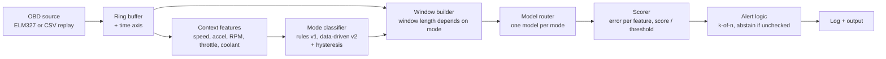

# Mode-Aware OBD-II Anomaly Detection on Raspberry Pi

> **Status:** planning · **Last updated:** 2026-09-29
> **One-line summary:** Feed OBD-II data in, figure out *what the car is doing* (idle, accelerating, decelerating, ...), then decide whether the sensors look normal *for that mode* — all running on a Raspberry Pi.

---

## Table of contents

1. [Goal and non-goals](#1-goal-and-non-goals)
2. [Why the current approach is not enough](#2-why-the-current-approach-is-not-enough)
3. [Driving and engine modes (research summary)](#3-driving-and-engine-modes-research-summary)
4. [System design](#4-system-design)
5. [Repository layout — how the work is split up](#5-repository-layout--how-the-work-is-split-up)
6. [Phases and tasks](#6-phases-and-tasks)
7. [Evaluation plan](#7-evaluation-plan)
8. [Raspberry Pi runtime plan](#8-raspberry-pi-runtime-plan)
9. [Bootstrap: exact steps and full config files](#9-bootstrap-exact-steps-and-full-config-files)
10. [Risks and open questions](#10-risks-and-open-questions)
11. [References](#11-references)

---

## 1. Goal and non-goals

**Goal.** A program on a Raspberry Pi that reads live (or replayed) OBD-II data and reports when the vehicle is behaving abnormally, where "abnormal" is judged **relative to the current operating mode**.

**Non-goals (for now).**
- Not a safety-critical system. Output is advisory only.
- Not fault *diagnosis* (which part is broken). We report which sensors contributed most to the score, nothing more.
- Not multi-vehicle generalization. The dataset is one car (Toyota Etios 2014); anything beyond that is a later phase.

---

## 2. Why the current approach is not enough

The starting point is `car_obd_autoencoder_fixed.py` (Colab notebook exported as a script).

**What it does today**
1. Downloads the carOBD dataset and loads the `idle*.csv` recordings (47 files).
2. Cuts each recording into 30-second windows using `ENGINE_RUN_TIME`, drops the last (incomplete) window, and computes mean and std of every sensor per window.
3. Removes startup windows (RPM std > 200 in the first three windows), constant features, and hand-picked "nuisance" features (fuel tank, time since codes cleared, warm-ups since codes cleared).
4. Splits **by recording**: idle1–33 train, idle34–40 calibration, idle41–47 test.
5. Standardizes, then trains a small autoencoder (features → 24 → 8 → 24 → features) on healthy idle windows.
6. Sets the anomaly threshold at the 99th percentile of calibration reconstruction error (about 1% false positives).
7. For a new file: builds a time axis, estimates speed/acceleration, labels each sample with a rule-based mode (`ENGINE_OFF`, `STARTUP`, `IDLE`, `ACCELERATING`, `DECELERATING`, `CRUISING`, `UNKNOWN`), groups into segments, and scores **only** windows that are entirely `IDLE`.

**The core gap:** mode detection exists, but only one mode has a model. Everything the car does while moving is labeled and then ignored. If you point the idle model at driving data you get meaningless scores, because "normal" for idle is not "normal" for acceleration.

**Other issues found while reading the code** (full list is turned into tasks in [Phase 0](#phase-0--repo-bootstrap-and-refactor)):

| # | Issue | Why it matters |
|---|-------|----------------|
| 1 | Nothing is saved: model, scaler, threshold, feature list, and sensor list live only in notebook globals | Cannot deploy to a Pi without retraining |
| 2 | Depends on Colab (`/content`, `display()`, `git clone` inside the script) | Not runnable as a normal script or on a Pi |
| 3 | Training "idle" comes from the *file name* (`idle*.csv`); inference "idle" comes from *speed ≤ 0.5 km/h*. Startup removal also differs (RPM-std heuristic in training vs. 30 s guard in inference) | Train/inference mismatch; the model may be scored on data unlike what it learned |
| 4 | Threshold is the 99th percentile of only the 7 calibration recordings, and the same calibration set is used for early stopping | With few windows the percentile is basically the maximum; thresholds are noisy and slightly optimistic |
| 5 | Split is by recording *number* (train = earliest, test = latest) | Any drift over time (season, temperature, wear) is confounded with the split; single vehicle, so no evidence of generalization |
| 6 | One MSE averaged over ~38 standardized features | A fault in one sensor gets diluted by the other ~37; needs per-feature error or a max/top-k score |
| 7 | Only validation is a fake overheating test (sets coolant mean=120, std=3, everything else untouched) | Shows the model rejects an impossible row, not that it finds realistic faults |
| 8 | One window above threshold = anomaly | 1% per window still means frequent false alarms over hours; needs a persistence rule |
| 9 | 30 s non-overlapping windows | Detection delay ≥ 30 s; acceleration and deceleration events are often shorter than 30 s, so a 30 s window will straddle modes |
| 10 | Cold/warm engine state is not modeled (only the first minutes are dropped) | Idle at 40 °C coolant and idle at 90 °C look different and will cause false alarms |
| 11 | Mode labeling uses `iterrows()` loops and back-fills labels after the debounce | Slow on a Pi; the back-fill uses future data, which a live system does not have |
| 12 | Mode acceleration is derived from integer-resolution speed over ~4–5 s with a ±0.15 m/s² threshold | Near the noise floor; expect chatter between `CRUISING` and `ACCELERATING` unless validated |
| 13 | No ground truth for modes, no evaluation of the mode labeler | We do not know how accurate the mode step is |
| 14 | Full TensorFlow/Keras is a heavy dependency for a ~2,300-parameter network | Use LiteRT or a plain NumPy forward pass on the Pi |

---

## 3. Driving and engine modes (research summary)

We need two different ideas of "mode": how the **car is moving**, and what the **engine controller is doing**. Both change what sensor values are normal.

### 3.1 Motion modes (from emissions / driving-cycle literature)

- The standard modal model splits driving into **idle, acceleration, cruise, deceleration**. Modal emission models compute results per mode.
- Some studies define cruise as roughly −0.1 to +0.1 m/s², with acceleration above and deceleration below. Our code uses ±0.15 m/s². This is a tunable choice, not a law.
- Real-world driving contains more acceleration/deceleration and less steady cruising than regulatory test cycles, so the transient modes cannot be treated as rare.
- Speed–acceleration matrices (speed bins × acceleration bins) are a common way to define finer modes than four.

### 3.2 Engine-controller modes (from ECU service documentation)

Fuel-injection engine controllers commonly define: ignition on (zero RPM), **start-up (crank)**, **warm-up**, cruise, idle, acceleration, deceleration, **wide-open throttle**, and ignition off.

- Start-up, warm-up, **deceleration with fuel shut-off**, and **wide-open throttle** are typically **open-loop** modes (fuel from a map, oxygen-sensor feedback not used).
- Idle, cruise, and normal acceleration/deceleration on a warm engine are typically **closed-loop**.

Why this matters for us: fuel trims and O2 sensor behavior mean something completely different in open vs. closed loop. A fuel-trim value that is fine during warm-up would be suspicious at warm cruise.

### 3.3 Contextual anomaly detection (the framing we want)

- Contextual anomaly detection separates **context variables** (what situation are we in) from **behavior variables** (what we are checking) and asks whether behavior is typical *given* context.
- Work on vehicle anomaly detection from standard OBD-II/CAN data makes the same point: vehicle state depends strongly on operating context, so context must be estimated and accounted for.
- Known failure mode: models dominated by frequent contexts mishandle rare contexts (false alarms or unstable decisions). We must handle sparse modes deliberately (see [Phase 4](#phase-4--per-mode-anomaly-models)).

### 3.4 Proposed taxonomy for this project

Sources above justify the top-level modes. The sub-modes are **proposals to be tested against data**, not established facts.

| Layer | Modes | Basis |
|-------|-------|-------|
| Validity | `ENGINE_OFF`, `UNKNOWN` (missing/invalid data) | Never scored. Report as "not checked". |
| Transient guard | `STARTUP` (first N seconds after engine on) | Already in code (30 s guard) |
| Thermal state (separate axis) | `WARMING` vs `WARM` (threshold from coolant temperature, calibrated from data) | Warm-up is open-loop (sourced); the exact coolant cutoff is **TBD from data** |
| Motion | `IDLE`, `ACCELERATING`, `CRUISING`, `DECELERATING` | Sourced (modal model) |
| Sub-modes (Phase 3, data-driven) | Hard acceleration / wide-open throttle; deceleration with closed throttle (fuel cut) vs. braking to a stop; low-speed stop-and-go vs. steady cruise; low vs. high speed cruise; possibly gear (from RPM ÷ speed ratio) if the car is a manual | Proposed; keep only if clustering and per-mode error support it |

Dataset context that helps us: the carOBD files are grouped as `idle` (stopped, engine on), `drive` (high-speed roads), `live` (a specific commute), `ufpe` (low-speed university campus), and `long` (long trips). The 27 PIDs come from a 2014 Toyota Etios. These file groups are **not** available at inference time, but they give us free sanity checks for the mode labeler (e.g., `ufpe` should be dominated by low-speed modes).

### 3.5 Design rule: context inputs vs. behavior inputs

The mode classifier must use a **small, robust set of signals** (speed, RPM, throttle, engine on/off, coolant for the thermal axis). The anomaly model then judges the **other** sensors (fuel trims, O2, MAF, MAP, intake temp, timing advance, load, ...). Reason: if a faulty sensor also decides the mode, the fault can hide itself by moving the car into a mode where that value is normal.

Exact column roles are confirmed in Phase 1 and stored in `src/obdanom/data/schema.py`.

---

## 4. System design



**Decision flow for each incoming sample**

1. Append to buffer; update speed, acceleration, engine-on state.
2. Classify the mode with hysteresis (a new mode must persist for `persist_s` before it is confirmed). Live labeling is **causal only** — no back-filling.
3. When a window for the current mode is complete (mode-specific length and minimum sample count), extract features.
4. Route to that mode's model. If no model exists, or the mode has too little training data, mark the window **`UNCHECKED`** — never "OK".
5. Score = reconstruction error divided by that mode's threshold. Keep per-feature errors so the output can say which sensors drove the score.
6. Raise an alert only when `k` of the last `n` scored windows exceed threshold.
7. Track and report **coverage**: what fraction of driving time was actually checked.

**Model options to compare (Phase 4/5)**

| Option | Description | Pros | Cons |
|--------|-------------|------|------|
| A. One model per mode (hard routing) | Separate small autoencoder per mode | Simple, small, easy to deploy | Sparse modes have little data; hard boundaries |
| B. Conditional autoencoder | Context (mode one-hot, speed, accel, thermal) fed to the network; reconstruct behavior features only | One model; smooth across mode boundaries | More sensitive to rare contexts (see 3.3) |
| C. Predict-then-compare | Regress each behavior sensor from context, monitor residuals | Interpretable, per-sensor | More models; needs good context features |
| Baseline | Per-mode robust z-score / Mahalanobis distance | Trivial to run on a Pi; strong sanity check | Ignores nonlinear structure |

**Plan:** build the baseline first, then A, then B, and let the evaluation in Section 7 pick. Do not commit to a deep model before the baseline exists.

---

## 5. Repository layout — how the work is split up

The notebook becomes a package. Each folder below is owned by one phase, so people can work in parallel without editing the same file.

```
obd-anomaly/
├── plan.md                      # this file
├── README.md                    # short intro + dataset citation
├── .gitignore
├── requirements-train.txt       # laptop / Colab / server
├── requirements-pi.txt          # Raspberry Pi runtime only
├── configs/
│   └── default.yaml             # every threshold and path lives here
├── docs/
│   ├── research-modes.md        # expanded version of Section 3 (Phase 3)
│   ├── architecture.md          # expanded version of Section 4
│   ├── evaluation.md            # fault catalogue + results (Phase 5)
│   └── pi-deployment.md         # wiring, install, benchmarks (Phase 6)
├── notebooks/
│   └── 00_original_idle_autoencoder.py   # the uploaded script, untouched, for reference
├── src/obdanom/
│   ├── __init__.py
│   ├── config.py                # load configs/default.yaml
│   ├── data/
│   │   ├── loader.py            # read CSV, clean column names, numeric coercion
│   │   ├── schema.py            # sensor names, units, role = context | behavior
│   │   └── windows.py           # batch windows (training) + streaming windows (Pi)
│   ├── modes/
│   │   ├── rules.py             # rule-based labeler (from original Blocks 33–36)
│   │   ├── hysteresis.py        # causal debounce, no back-filling
│   │   ├── thermal.py           # WARMING vs WARM
│   │   └── discovery.py         # clustering experiments (Phase 3)
│   ├── features/
│   │   └── extract.py           # window -> feature vector (mean/std/... per sensor)
│   ├── models/
│   │   ├── baseline.py          # robust z-score / Mahalanobis per mode
│   │   ├── autoencoder.py       # Keras model builder
│   │   ├── numpy_forward.py     # dependency-free inference for the Pi
│   │   └── registry.py          # mode -> model, threshold, feature list, min-data rule
│   ├── training/
│   │   ├── train_mode_models.py # trains all modes, saves artifacts
│   │   └── calibrate.py         # per-mode thresholds
│   ├── eval/
│   │   ├── fault_injection.py   # synthetic faults
│   │   ├── metrics.py           # per-mode detection rate, false alarms per hour
│   │   └── report.py            # writes results tables/plots
│   └── runtime/
│       ├── obd_source.py        # ELM327 reader and CSV replay behind one interface
│       ├── pipeline.py          # ties everything together, streaming
│       ├── alerts.py            # k-of-n logic, coverage tracking
│       └── export.py            # Keras -> LiteRT / NPZ weights
├── scripts/
│   ├── download_data.sh
│   ├── train.py
│   ├── evaluate.py
│   └── run_replay.py
├── artifacts/                   # saved models/scalers/thresholds (gitignored except manifest)
└── tests/
    ├── test_loader.py
    ├── test_modes_rules.py
    ├── test_windows.py
    ├── test_parity_with_notebook.py
    └── test_pipeline_replay.py
```

---

## 6. Phases and tasks

Each checkbox is meant to become a GitHub issue. "Done when" is the acceptance test.

### Phase 0 — Repo bootstrap and refactor

Goal: the existing idle detector runs from a normal repo, produces the same numbers as the notebook, and saves its artifacts.

- [ ] Create the repo structure from Section 5 and commit the original script under `notebooks/`.
- [ ] Add `configs/default.yaml`, `requirements-*.txt`, `.gitignore` (full contents in Section 9).
- [ ] Move data loading (original Blocks 3–4) into `data/loader.py`; remove Colab-only code (`/content`, `display`).
- [ ] Move windowing (Blocks 5–9) into `data/windows.py` and feature extraction into `features/extract.py`.
- [ ] Move mode code (Blocks 30–36) into `modes/rules.py` and `modes/hysteresis.py`; read all thresholds from config.
- [ ] Save the trained model, scaler (mean and scale as JSON), threshold, `model_features`, and `required_raw_sensors` to `artifacts/`.
- [ ] Write `test_parity_with_notebook.py`: same window count, same feature count, same threshold (within tolerance) as the notebook.

**Done when:** `python scripts/train.py --mode IDLE` and `python scripts/run_replay.py --file idle47.csv` reproduce the notebook's output, and no step depends on Colab.

### Phase 1 — Data understanding and schema

Goal: know exactly what is in every file type before modeling more modes.

- [ ] Load all five file groups (`idle`, `drive`, `live`, `ufpe`, `long`); print rows, duration, and columns per file.
- [ ] Measure the actual sample rate per file (rows per second; how often `ENGINE_RUN_TIME` changes).
- [ ] Record missing-value rate and constant columns per file group.
- [ ] Decide each column's role (**context** or **behavior**) and write it into `data/schema.py` with units.
- [ ] Look at coolant temperature over time to pick the `WARMING`/`WARM` cutoff; write the value into config.
- [ ] Check whether ENGINE_RUN_TIME ever resets or jumps inside a file (affects windowing and session logic).
- [ ] Note whether the car is manual or automatic (affects the gear sub-mode idea).

**Done when:** `docs/data-summary.md` exists with per-group tables, and `schema.py` lists every sensor with a role.

### Phase 2 — Mode detection v1 (rules) and validation

Goal: a fast, causal, tested mode labeler.

- [ ] Vectorize `assign_modes` (no `iterrows`), then build the streaming version that processes one sample at a time.
- [ ] Remove back-filling from the debounce; measure how much latency this adds.
- [ ] Add throttle and RPM as optional inputs so acceleration is not decided from speed alone.
- [ ] Add the `WARMING`/`WARM` axis.
- [ ] Sanity-check label distributions per file group (`idle` files mostly `IDLE`; `ufpe` mostly low-speed; `drive` mostly `CRUISING`).
- [ ] Measure label chatter: mode changes per minute and fraction of segments shorter than `persist_s`.
- [ ] Sweep `accel_threshold` (e.g., 0.10, 0.15, 0.20 m/s²) and pick with evidence.
- [ ] Hand-label a small set of segments (a few minutes from each file group) to compute a real confusion matrix.

**Done when:** batch and streaming labelers give identical labels on the same file (apart from documented startup differences), chatter is below the target in config, and a confusion matrix against hand labels is in `docs/`.

### Phase 3 — Mode discovery (find the modes we do not know about)

Goal: use data, not guesses, to decide the final mode list.

- [ ] Build a context feature table (speed, acceleration, RPM, throttle, coolant, RPM÷speed).
- [ ] Draw the speed × acceleration occupancy map (how much time is spent in each cell) for each file group.
- [ ] Cluster context features (start with k-means and a Gaussian mixture; try a density-based method if clusters are uneven). Vary k and check stability across recordings.
- [ ] Compare clusters to the rule-based labels. Where clusters split a rule mode, look at what separates them (throttle? RPM/speed ratio? load?).
- [ ] For each candidate sub-mode, check that behavior sensors really differ between sub-modes (otherwise keep the coarser mode).
- [ ] Write `docs/research-modes.md`: final taxonomy, thresholds, and evidence.

**Done when:** a final mode list v2 is agreed, each mode has a definition that can be computed causally on the Pi, and the amount of training data per mode is tabulated.

### Phase 4 — Per-mode anomaly models

Goal: a model (or an explicit "unchecked" rule) for every mode.

- [ ] Choose window length per mode (idle can stay 30 s; transient modes probably need ~5–10 s or should use the whole mode segment). Store in config.
- [ ] Split **by recording and by time-block** so train / calibration / test do not share sessions, and report how sensitive results are to the split.
- [ ] Build the per-mode baseline (robust z-score / Mahalanobis).
- [ ] Build per-mode autoencoders (Option A). Keep architectures small.
- [ ] Build the conditional autoencoder (Option B) for comparison.
- [ ] Replace the single mean-MSE score with per-feature errors plus a summary (max, top-k mean); compare on injected faults.
- [ ] Thresholds from a held-out calibration set with a minimum window count; below the minimum, the mode is `UNCHECKED` or uses a conservative baseline threshold.
- [ ] Add a per-mode "insufficient data" report.

**Done when:** `scripts/train.py` trains all modes from config, saves artifacts plus a manifest (data hash, config hash, git commit), and `registry.py` returns a model or an explicit `UNCHECKED` for every mode.

### Phase 5 — Evaluation

Goal: real evidence that the system works, mode by mode. Details in Section 7.

- [ ] Implement the fault injector.
- [ ] Run the four-way comparison (idle-only, one global model, per-mode, conditional).
- [ ] Report false alarms per hour of healthy driving, per mode and overall.
- [ ] Report detection rate and detection delay per fault type, per mode.
- [ ] Write `docs/evaluation.md`.

**Done when:** results tables exist for every mode and the team has agreed on the model to ship.

### Phase 6 — Raspberry Pi runtime

Goal: the chosen model runs live on the Pi within budget. Details in Section 8.

- [ ] Implement `obd_source.py` with two backends behind one interface: CSV replay and ELM327.
- [ ] Implement `pipeline.py` (streaming) and `alerts.py` (k-of-n, coverage).
- [ ] Export weights to a NumPy file and/or LiteRT (`runtime/export.py`); implement `numpy_forward.py`; test that outputs match Keras within tolerance.
- [ ] Replay every test file through the Pi pipeline and confirm the results match the offline evaluation.
- [ ] Benchmark CPU, memory, and per-sample latency on the actual Pi model.
- [ ] Run live in the car with logging only (no alerts shown) for several trips.

**Done when:** replay results equal offline results, benchmarks are inside budget, and at least a few live trips are logged.

### Phase 7 — Hardening

- [ ] Alert logic tuning using live logs.
- [ ] Handle dropped OBD frames, sensors that return no data, and reconnects.
- [ ] Drift monitoring (per-mode score distribution over time) and a documented retraining procedure.
- [ ] Decide what happens when a new vehicle is connected (separate calibration run?).

---

## 7. Evaluation plan

The carOBD data is recorded from a healthy vehicle, and we found no labeled fault data in the repository description, so we must create test anomalies.

**Metrics**
- False alarms per hour of healthy driving (overall and per mode) — using held-out recordings.
- Detection rate and time-to-detect per fault type and per mode.
- Coverage: fraction of driving time that was checked (not `UNCHECKED`).
- Mode labeler: confusion matrix against hand labels, and chatter rate.

**Fault catalogue (`eval/fault_injection.py`)** — inject into healthy recordings, ideally keeping physical relationships (e.g., a coolant fault should not also change RPM):
- Stuck value (sensor freezes)
- Offset / bias (e.g., coolant reads +15 °C, fuel trim biased)
- Gain error (scale wrong)
- Slow drift
- Spikes / dropouts
- Slow response (a sensor that lags the true change)
- Cross-sensor inconsistency (e.g., MAF vs. MAP vs. RPM relationship broken)

**Comparisons (ablation)**
1. Idle model only (current code)
2. One global model, no modes
3. Per-mode models (Option A)
4. Conditional autoencoder (Option B)
5. Baselines (robust z-score / Mahalanobis per mode) alongside each

**Motivating experiment (do this first):** run the current idle model on driving windows and record the false-alarm rate. This is the number that proves mode-awareness is needed.

**Suggested targets (proposals for the team to accept or change)**
- False alarms: ≤ 1 per hour of healthy driving after the k-of-n rule.
- Detection: agree on a minimum fault size per sensor (e.g., a specified coolant offset) and require detection within a stated number of windows.

---

## 8. Raspberry Pi runtime plan

**Which Pi?** Not yet decided (see Section 10). A Pi Zero W is what the original dataset author used for OBD reading, alongside an ELM327 Bluetooth adapter. Newer boards have far more headroom.

**Keep the runtime light**
- The current network has about 2,300 parameters. A forward pass in plain NumPy is cheap, so **the Pi does not need TensorFlow**. Train on a laptop or Colab; ship weights and scaler statistics as JSON/NPZ.
- If a runtime is preferred, Google's LiteRT is the successor to TensorFlow Lite, and the Python package is `ai-edge-litert` (replacing `tflite-runtime`). Check that a wheel exists for your Pi's OS and architecture; if not, use the NumPy forward pass.
- Estimated time per scoring step should be measured, not assumed; add a benchmark script in Phase 6.

**Budgets (proposals — measure, then adjust)**
- Per-sample processing well under the OBD polling interval.
- Memory: comfortably inside the board's RAM alongside Raspberry Pi OS.
- Detection delay: one window length plus `persist` logic; state it explicitly in the docs.

**Data rate**
OBD-II polling over ELM327 limits how many PIDs you can read per second. Measure the real rate on the car; the whole time axis, mode thresholds, and window lengths depend on it.

**Replay first.** Every feature must work on `run_replay.py` (CSV in, decisions out) before touching the car, so bugs are caught at a desk.

---

## 9. Bootstrap: exact steps and full config files

### 9.1 Steps

```bash
# 1. Create the repo
mkdir obd-anomaly && cd obd-anomaly
git init

# 2. Create folders
mkdir -p configs docs notebooks scripts artifacts tests data
mkdir -p src/obdanom/{data,modes,features,models,training,eval,runtime}
touch src/obdanom/__init__.py
touch src/obdanom/{data,modes,features,models,training,eval,runtime}/__init__.py

# 3. Python environment (training machine)
python3 -m venv .venv
source .venv/bin/activate
pip install --upgrade pip
pip install -r requirements-train.txt   # after you create the file below

# 4. Get the dataset (kept out of git; cite the author, see README)
git clone https://github.com/eron93br/carOBD.git data/carOBD

# 5. Keep the original script for reference
cp /path/to/car_obd_autoencoder_fixed.py notebooks/00_original_idle_autoencoder.py

# 6. First commit
git add .
git commit -m "Bootstrap repo layout and plan"
```

### 9.2 `.gitignore`

```gitignore
.venv/
__pycache__/
*.pyc
.ipynb_checkpoints/
data/carOBD/
artifacts/*
!artifacts/manifest.json
*.tflite
*.h5
*.keras
.DS_Store
```

### 9.3 `requirements-train.txt`

```text
numpy
pandas
scikit-learn
tensorflow
matplotlib
pyyaml
joblib
pytest
```

### 9.4 `requirements-pi.txt`

```text
numpy
pyyaml
obd
pyserial
# Optional, only if a wheel exists for your Pi's OS/architecture:
# ai-edge-litert
```

### 9.5 `configs/default.yaml`

Values marked `# from original code` are copied from the uploaded script. Values marked `# proposal` are starting points to be tuned.

```yaml
data:
  dataset_dir: data/carOBD/obdiidata
  file_groups:
    idle: "idle*.csv"
    drive: "drive*.csv"
    live: "live*.csv"
    ufpe: "ufpe*.csv"
    long: "long*.csv"
  default_sample_period_s: 1.0        # from original code
  drop_columns_prefix: "Unnamed"      # from original code

modes:
  context_window_s: 5.0               # from original code
  persist_s: 2.0                      # from original code
  startup_guard_s: 30.0               # from original code
  engine_on_rpm: 100.0                # from original code
  stopped_speed_kmh: 0.5              # from original code
  accel_threshold_mps2: 0.15          # from original code
  decel_threshold_mps2: -0.15         # from original code
  warm_coolant_c: null                # set in Phase 1 from data
  max_mode_changes_per_minute: null   # set in Phase 2

windows:
  idle_s: 30.0                        # from original code
  accelerating_s: 10.0                # proposal
  decelerating_s: 10.0                # proposal
  cruising_s: 30.0                    # proposal
  min_samples_per_window: 5           # proposal
  drop_final_incomplete_window: true  # from original code

features:
  stats: [mean, std]                  # from original code
  nuisance_sensors:                   # from original code
    - FUEL_TANK
    - TIME_SINCE_TROUBLE_CODES_CLEARED
    - WARM_UPS_SINCE_CODES_CLEARED

training:
  seed: 42                            # from original code
  split_unit: recording               # from original code (split by file)
  min_windows_per_mode: 100           # proposal; below this the mode is UNCHECKED
  autoencoder:
    hidden: [24, 8, 24]               # from original code
    activation: relu                  # from original code
    optimizer: adam                   # from original code
    loss: mse                         # from original code
    batch_size: 32                    # from original code
    max_epochs: 150                   # from original code
    early_stopping_patience: 10       # from original code

threshold:
  method: percentile                  # from original code
  false_positive_rate: 0.01           # from original code
  min_calibration_windows: 30         # proposal

alerts:
  k: 2                                # proposal (k of n windows)
  n: 3                                # proposal
  report_unchecked: true

runtime:
  source: replay                      # replay | elm327
  replay_file: data/carOBD/obdiidata/idle47.csv
  elm327_port: /dev/rfcomm0           # proposal; depends on your adapter
  poll_hz: 1.0                        # proposal; measure on the car
  artifacts_dir: artifacts
```

---

## 10. Risks and open questions

**Open questions (need a team decision)**
1. **Which Raspberry Pi model?** This sets the budget and whether LiteRT wheels are available.
2. **Live OBD or replay only for the first release?** Live adds adapter, reconnect, and rate issues.
3. **Same car only, or other vehicles?** Only one car (2014 Toyota Etios) is in the dataset.
4. **Manual or automatic transmission?** Determines whether a gear-based sub-mode makes sense.
5. **What counts as an anomaly we care about first?** (e.g., coolant, fuel trim, MAF). Drives the fault catalogue.

**Risks**
- *Sparse modes:* transient modes may have little data; mitigation is `UNCHECKED` plus coverage reporting.
- *No real fault labels:* results depend on how realistic the injected faults are; state this limit in every report.
- *Single vehicle, limited time span:* results may not transfer across seasons or cars.
- *OBD polling rate is low and irregular:* windows and acceleration estimates may be coarse; measure early (Phase 1).
- *Mode mistakes cascade:* a wrong mode means the wrong model scores the window; track mode-labeler accuracy separately.
- *Advisory only:* this must not be presented as a safety system.

---

## 11. References

- carOBD dataset (Toyota Etios 2014, 27 PIDs, file groups idle/drive/live/ufpe/long) — https://github.com/eron93br/carOBD — **the author asks that users cite the associated IEEE article** (linked from the repository); add the citation to `README.md`.
- carOBD Raspberry Pi Zero W + ELM327 reader wiki — https://github.com/eron93br/carOBD/wiki
- Modal emission analysis (idle / constant speed / acceleration / deceleration) — https://www.sciencedirect.com/science/article/abs/pii/004896979504646I
- NCHRP Web-Only Document 122, modal emissions model (speed/acceleration matrix) — https://onlinepubs.trb.org/onlinepubs/nchrp/nchrp_w122.pdf
- Driving cycles review (cruise defined near ±0.1 m/s²) — https://www.researchgate.net/publication/355926001_Driving_Cycles_for_Estimating_Vehicle_Emission_Levels_and_Energy_Consumption
- Open-loop vs. closed-loop engine control modes — https://www.lxforums.com/threads/open-closed-loop-explained-service-manual.87624/
- Context-aware anomaly detection from vehicle dynamics (OBD-II/CAN) — https://dl.acm.org/doi/fullHtml/10.1145/3678890.3678895
- Rarity-aware contextual anomaly detection (frequency bias) — https://arxiv.org/pdf/2606.13311
- Review of OBD-II based machine learning applications — https://www.ncbi.nlm.nih.gov/pmc/articles/PMC12251678/
- LiteRT (TensorFlow Lite successor) migration notes — https://developers.google.com/edge/litert/migration
- LiteRT samples (Python on Raspberry Pi/Linux) — https://github.com/google-ai-edge/litert-samples
